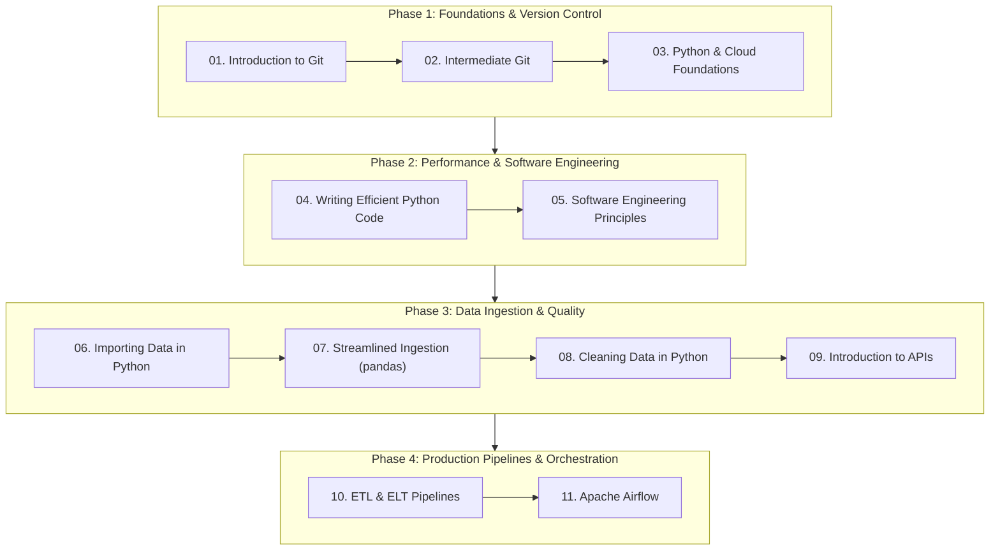

# ⚙️ Data Engineering in Python - Study Curriculum

Welcome to the **Data Engineering in Python** track! This section consolidates professional-grade study guides, code scripts, architectural patterns, and Anki active recall flashcards derived from the DataCamp Career Track.

## 🗺️ Curriculum Structure & Progression

## 📚 Modules Overview

1. [01. Introduction to Git](./01-introduction-to-git/understanding-git-basics.md): CLI, object model, staging area, commit graphs, and audit logs.
2. [02. Intermediate Git](./02-intermediate-git/understanding-intermediate-git.md): 3-way merge, fast-forward, conflict resolution, and remote synchronization.
3. [03. Python for Developers & Cloud](./03-python-for-developers-and-cloud/understanding-python-cloud.md): Data structures, functions, docstrings, and cloud architecture (AWS, Azure, GCP).
4. [04. Writing Efficient Code](./04-writing-efficient-code/understanding-writing-efficient-code.md): CPython execution model, line/memory profiling, vectorized NumPy and Pandas.
5. [05. Software Engineering Principles](./05-software-engineering-principles/understanding-software-engineering-principles.md): Modularity, PEP 8, OOP design, packaging, and testing with pytest.
6. [06. Importing Data in Python](./06-importing-data-in-python/understanding-importing-data.md): Flat files, binary formats (HDF5, SAS, Stata), SQLite, and web scraping.
7. [07. Streamlined Ingestion with pandas](./07-streamlined-data-ingestion-pandas/understanding-streamlined-ingestion.md): Out-of-core chunking, strict dtypes, SQLAlchemy streaming, and JSON.
8. [08. Cleaning Data in Python](./08-cleaning-data-in-python/understanding-cleaning-data.md): Data constraints, text normalization, regex, and record linkage deduplication.
9. [09. Introduction to APIs in Python](./09-introduction-to-apis-in-python/understanding-apis-in-python.md): HTTP protocol, REST conventions, rate limiting, pagination, and retry logic.
10. [10. ETL & ELT Pipelines](./10-etl-and-elt-pipelines/understanding-etl-elt.md): Pipeline architectures, Parquet storage, transactional safety, and idempotent loads.
11. [11. Apache Airflow](./11-apache-airflow/understanding-apache-airflow.md): DAGs, TaskFlow API (`@task`), sensors, SLA alerting, and production scheduling.
